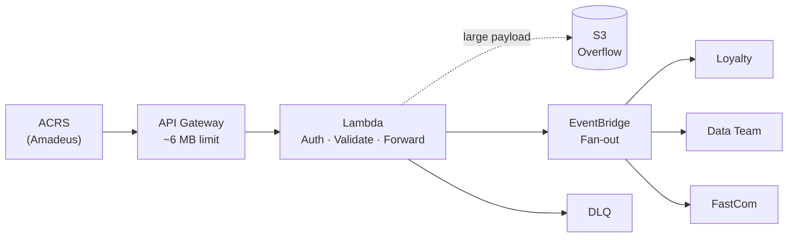
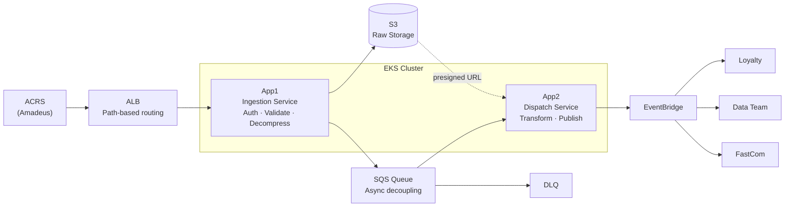

# ACP-ACRS Feeds Dispatcher

Event-driven integration layer between ACRS (Amadeus) and internal consumers. Distributes hotel data feeds reliably while decoupling the producer (ACRS) from multiple downstream consumers. Built to handle high volume, multiple consumers, and different payload formats (JSON, Gzip, large files).

---

## Repository Structure

```
ACP-ACRS-Feeds-Dispatcher/
├── docs/                        # Reference documentation
│   ├── architecture/            # System design, ADRs, diagrams
│   │   ├── adr/                 # Architecture Decision Records
│   │   └── diagrams/            # Standalone diagram sources
│   ├── business/                # Product brief, value map
│   ├── onboarding/              # Publisher & consumer onboarding guides
│   ├── runbooks/                # Incident response, deployment checklist
│   └── compliance/              # ACP Label Framework status
│
├── product/                     # Product workspace (PO-owned)
│   ├── roadmap.md
│   ├── backlog.md
│   └── feedback/                # Async stakeholder feedback
│
├── services/                    # Application source code
│   ├── app1-ingestion/          # Receives feeds → S3 + SQS
│   └── app2-dispatch/           # SQS → transform → EventBridge
│
├── infra/                       # Infrastructure as Code
│   ├── terraform/
│   │   ├── modules/
│   │   │   ├── consumer/        # Terraform module: onboard a consumer
│   │   │   └── endpoint/        # Terraform module: onboard a feed endpoint
│   │   └── environments/
│   │       ├── dev/
│   │       ├── oat/
│   │       └── prod/
│   └── helm/
│       ├── app1-ingestion/      # Helm chart + per-env values
│       └── app2-dispatch/       # Helm chart + per-env values
│
├── deploy/                      # ArgoCD deployment manifests
│   └── argocd/
│       ├── project.yaml
│       ├── app1-ingestion.yaml  # DEV / OAT / PROD Applications
│       └── app2-dispatch.yaml
│
├── monitoring/                  # Dashboards and alert definitions
│   ├── cloudwatch/              # CloudWatch dashboards + alarms
│   └── splunk/                  # Splunk dashboards
│
└── .github/
    ├── CODEOWNERS
    ├── pull_request_template.md
    └── workflows/               # CI pipelines (build, push to ECR, scan)
```

---

## Table of Contents

- [Architecture Overview](#architecture-overview)
  - [Current Architecture (v1/v2 – Serverless)](#current-architecture-v1v2--serverless)
  - [Target Architecture (v4 – EKS-based)](#target-architecture-v4--eks-based)
- [Components](#components)
- [Key Design Decisions](#key-design-decisions)
- [Environments](#environments)
- [Consumers](#consumers)
- [Request & Onboarding Flow](#request--onboarding-flow)
- [Security & Compliance](#security--compliance)
- [Performance & Testing](#performance--testing)
- [Deployment](#deployment)
- [Monitoring](#monitoring)
- [Business Value](#business-value)
- [Current Status](#current-status)

---

## Architecture Overview

### Current Architecture (v1/v2 – Serverless)



| Component | Role |
|-----------|------|
| API Gateway | Entry point; ~6 MB payload limit |
| Lambda | Auth (Cognito / Lambda Authorizer), validation, event forwarding |
| EventBridge | Core routing, fan-out to multiple consumers |
| S3 | Overflow storage for oversized payloads |
| DLQ | Failed delivery handling |

**Known limitations:**

- API Gateway hard payload limit (~6 MB) — many feeds exceed 4 MB
- Lambda concurrency pressure under sustained load
- Cognito throttling (~120 RPS on auth APIs)
- Not designed for sustained high throughput or large file ingestion
- Gzip support was toggled per endpoint as a workaround, not a scalable solution
- Cost: Cognito alone reached ~$4K/month; Lambda + API GW not cost-efficient at scale

---

### Target Architecture (v4 – EKS-based)



Moves from serverless to container-based architecture on EKS, eliminating payload size constraints and reducing operational complexity.

---

## Components

### ALB (Application Load Balancer)
- Replaces API Gateway
- Handles path-based routing and high throughput
- No payload size limitation equivalent to API GW

### App1 – Ingestion Service
- Identifies feed type via request path (e.g. `/feed-a`)
- Authenticates the request
- Validates and decompresses payload (JSON or Gzip)
- Stores raw file in S3
- Sends a lightweight reference message to SQS (not the full payload)

### S3
- Stores raw payloads
- Source of truth for large files
- Referenced via presigned URLs in downstream events

### SQS
- Decoupling layer between ingestion and dispatch
- Async processing with built-in retry capability

### App2 – Dispatch / Preparation Service
- Reads messages from SQS
- Transforms data into consumer-ready format
- Publishes events to EventBridge (or other downstream targets)
- Passes S3 presigned URL for large payloads instead of embedding data in the event

### DLQ
- Catches failed SQS processing
- Enables retry and investigation of failed messages

---

## Key Design Decisions

**Large Payload Strategy**
- Do NOT embed large payloads in events
- Store payload in S3 and pass a reference URL
- Aligned with AWS best practices

**Message Ordering**
- Strict ordering is not required
- System tolerates out-of-order delivery and duplicate messages

**Deduplication**
- Not implemented in current version
- Planned for a future iteration

**Feed Identification**
- Path-based routing is preferred (e.g. `/feed-a`)
- Header or auth identity can also be used as secondary identifiers

---

## Environments

| Environment | Notes |
|-------------|-------|
| DEV | Development environment |
| OAT | Aggregates UAT / TEST / MIG / PDT — can be separate namespaces |
| PROD | Production |

---

## Consumers

Known downstream systems:

- **Loyalty**
- **Data Team**
- **FastCom**

Each consumer is set up with:
- Dedicated EventBridge event bus
- DLQ
- Logging
- Terraform module provisioning

Consumer configuration requires:
- `event_bus_arn`
- Allowlisting on the dispatcher side

---

## Request & Onboarding Flow

### Publisher (ACRS / new feed)
1. Submit request via ServiceNow with:
   - Canonical feed name
   - Action type
   - Description
2. Team creates endpoint via Terraform and configures routing

### Consumer
1. Set up via the consumer Terraform module
2. Provide EventBridge ARN for allowlisting

---

## Security & Compliance

- Must comply with the **ACP Label Framework** (Security, Operational, Architecture)
- Health endpoints:
  - `GET /health` — public, rate limited
  - `GET /health/details` — authenticated

- Azure EntraID authentication may require proxy whitelist configuration for external access

---

## Performance & Testing

Performance testing is required to:
- Define pod sizing for EKS
- Validate large file handling end-to-end
- Set ingestion limits and thresholds

---

## Deployment

- **ArgoCD** manages deployments
- **Helm charts** stored in ECR
- CI pipeline steps:
  1. Build image
  2. Push to ECR
  3. Scan (Wiz, Checkmarx)

**PROD constraint:** Downtime must be under 2 minutes (upstream ACRS retry window = 2 min).
For high-risk releases, use per-endpoint rollout to minimize blast radius.

---

## Monitoring

| Platform | Scope |
|----------|-------|
| CloudWatch | API, Lambda, EventBridge, DLQ, S3 |
| Splunk | FIS, UAT, TEST, MIG dashboards |

---

## Business Value

| Goal | Outcome |
|------|---------|
| Decouple ACRS from consumers | Producers and consumers evolve independently |
| Multi-consumer distribution | Single feed → multiple downstream systems |
| Scalability | EKS removes serverless payload and concurrency limits |
| Flexibility | JSON + Gzip handled natively without per-endpoint toggles |
| Resilience | SQS + DLQ ensure reliable delivery and retry |
| Cost optimization | Reduces Cognito and Lambda overhead significantly |

---

## Current Status

- Migrating to EKS (target next PI)
- Performance testing in progress
- ACP Label Framework compliance ~70% complete
- Cognito usage being reduced / phased out
- Some CloudWatch/Splunk dashboards pending final validation
