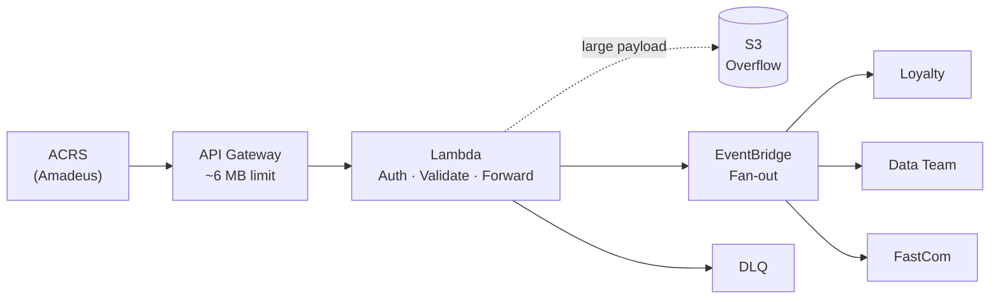
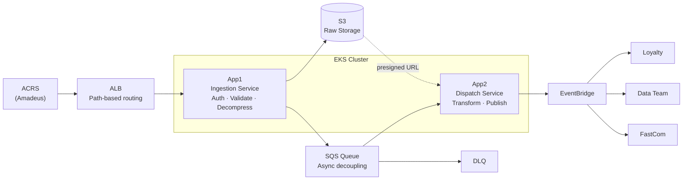

# Architecture Overview

## Current Architecture (v1/v2 – Serverless)



### Limitations
- API Gateway hard payload limit (~6 MB) — many feeds exceed 4 MB
- Lambda concurrency pressure under sustained load
- Cognito throttling (~120 RPS on auth APIs)
- Gzip toggle was a workaround, not a scalable solution
- Cost: Cognito alone reached ~$4K/month

---

## Target Architecture (v4 – EKS-based)



### Key Improvements
- No payload size constraint (ALB replaces API Gateway)
- Handles JSON and Gzip natively — no per-endpoint toggle
- SQS decouples ingestion from dispatch, enabling async retry
- Large payloads stored in S3; only references travel through the event pipeline
- EKS pod scaling replaces Lambda concurrency limits
- Eliminates Cognito cost (~$4K/month saved)

---

## Component Responsibilities

| Component | Responsibility |
|-----------|---------------|
| ALB | TLS termination, path-based routing to App1 |
| App1 (Ingestion) | Auth, validation, decompression, S3 write, SQS enqueue |
| S3 | Source of truth for raw payloads |
| SQS | Async buffer between ingestion and dispatch |
| App2 (Dispatch) | SQS consume, transform, EventBridge publish |
| DLQ | Catch and hold failed SQS messages for investigation |
| EventBridge | Fan-out to downstream consumers |

---

## Data Flow — Large Payload

```
ACRS sends >4 MB feed
  → ALB routes to App1
    → App1 decompresses + validates
      → App1 writes raw file to S3
        → App1 enqueues lightweight message (S3 key, feed type, metadata) to SQS
          → App2 consumes SQS message
            → App2 generates S3 presigned URL
              → App2 publishes event to EventBridge (with URL, not payload)
                → Consumers fetch from presigned URL directly
```
